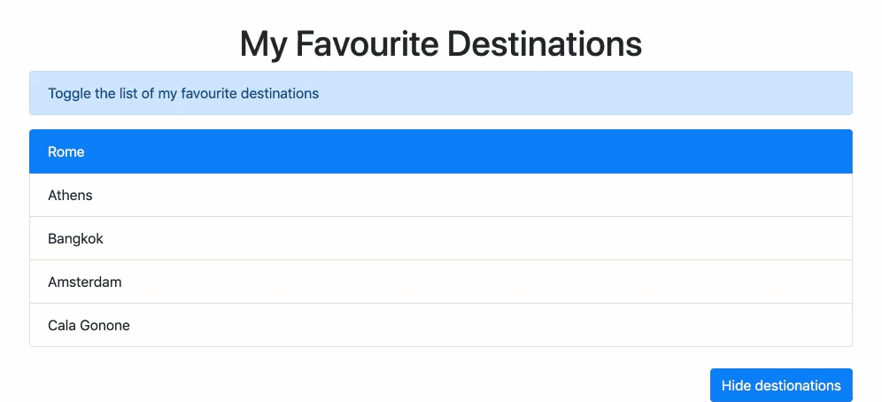

# Toggle Favourite Destinations

## Result-Link:https://mkisecok.github.io/toggle-item-JS-/

Create a list of your favourite destinations with a button to toggle the list

**Requirements:**
- use Bootstrap CDN
- use `Element.classList` methods

**Example:**

**Bonus:**

- Let the user select the favourite destination
- Show in the event object
- Style the list to your pleasing.

